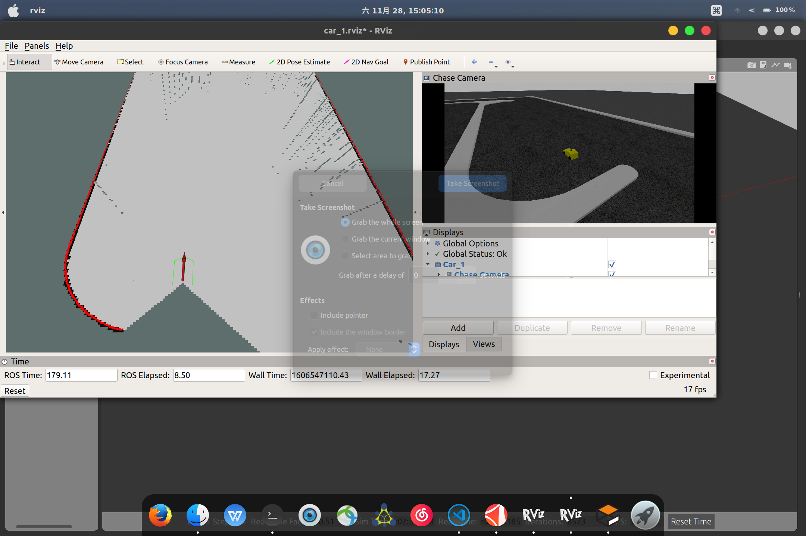

# markdown tutorial
## how to insert a photo
### local photo

### online photo

## how to insert video
### local
<video id="video" controls="" preload="none" poster="">
<source id="mp4" src="demo_video.mp4" type="video/mp4">
</video>
### online
<video id="video" controls="" preload="none" poster="http://media.w3.org/2010/05/sintel/poster.png">
      <source id="mp4" src="http://media.w3.org/2010/05/sintel/trailer.mp4" type="video/mp4">
      <source id="webm" src="http://media.w3.org/2010/05/sintel/trailer.webm" type="video/webm">
      <source id="ogv" src="http://media.w3.org/2010/05/sintel/trailer.ogv" type="video/ogg">
      
Your user agent does not support the HTML5 Video element.

    </video>
## summary
The current markdown doesn't support video directly. You can use a photo to fake it. 

See https://stackoverflow.com/questions/11804820/how-can-i-embed-a-youtube-video-on-github-wiki-pages

Or you can use html like I did. But you may have to adjust some parameter for better scaling. Google it then. 

There is something wrong in IDE. I guess a plugin for markdown is not installed in CLion. So you can search it and install it. Or you can use typora, another app, instead. 

